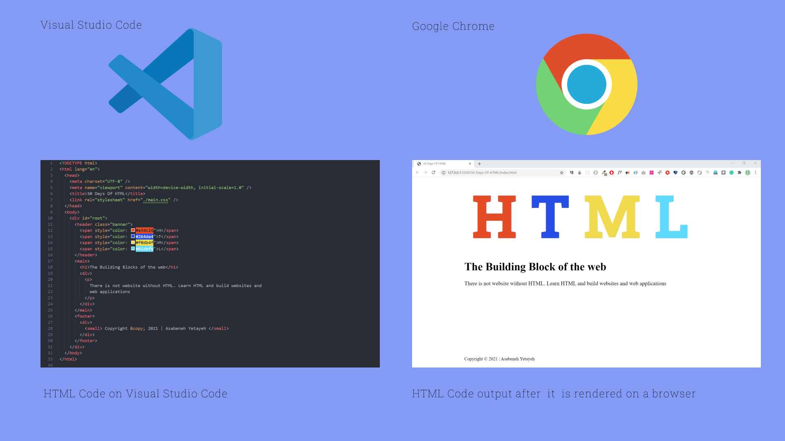
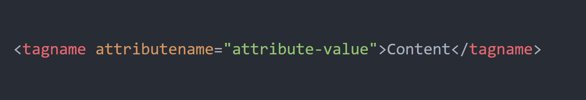

# HTML Documentation

## 1. Introduction to HTML
• Knowing how to code in any language is a valuable skill. Despite how complex websites 
may be, they are still built with the fundamental blocks of the web, HTML. HTML and CSS 
are the frameworks used to build websites. If you can understand how they work together, 
you’re much better off when it comes to building websites.  


### What is HTML (Hyper-Text Markup Language)? 
▪ It is just a standardized system of tagging a text file 
▪ A text file that is "tagged" following the "HTML standard" is called an HTML 
document 
▪ Both web developers and web browsers follow this standard to generate expected 
outcomes

**▪HTML**  is the standard language for creating web pages. It describes the structure of a webpage using elements represented by tags.

**▪ HTML** is the build block of the web that allows building layouts of page using HTML elements. HTML is not not a programming language instead it is a markup language.

**▪ HTML** code will be rendered by a browser and it give a human readable output. Look at the figure bellow to understand better how the HTML code convert to a website using a browser.



- **Purpose**: Defines the structure and content of web pages.
- **Role**: Works with CSS for styling and JavaScript for functionality.

---
#### HTML Versions
▪ There are 5 versions of HTML so far, from HTML 1.0 to the most recent one, HTML5.
**For this course, you only need to focus on HTML5. Reasons:**
-  Browsers understand earlier versions anyways 
-  HTML5 is simplified 
-  HTML5 has better error handling ways 
-  HTML5 has multimedia elements, meaning, browsers that support HTML 5 are also 
- media players for video and audio 
- Includes semantic content by including `<header>`, `<footer>`, `<article>`, `<section>`, and `<figure>`.

### Why Should You Learn HTML? (Purpose of Learning HTML)

- The primary goal of learning HTML is to understand how to properly tag your text documents so that the browser understands what you are attempting to accomplish.  

  For example:  
  - If you want to include a title in a text document, how could you tell that it’s a title?  
  - If you want to include a paragraph, how do you tell it’s a paragraph?  

- To accomplish this, simply adhere to a standard that browsers can comprehend.

### How to Write HTML Code in Visual Studio Code (VSC)

The following are the most common tasks you can perform using Visual Studio Code:

- **Open an existing folder or file**
- **Create a new folder in a specific location**
- **Create a new file in a specific location**
- **Make edits and save**
- **Rename files and/or folders**
  

  ## 2. Basic Rules of HTML Tags

#### What Do HTML Tags Do?
- Tags provide web browsers with instructions about the type of text included in the HTML document.  
- HTML tags are hidden keywords within a web page that specify how the browser should format and display the content.  


.png)
**Examples:**  
- `<h1>`: `<h1>This text is a header</h1>`  
- `<p>`: `<p>This text is a paragraph</p>`  

---

#### Rules of HTML Tags

1. **Tags Are Always Enclosed in Angle Brackets:** `< >`  
   - Example: `<p>` This is a paragraph tag enclosed in angle brackets.  

2. **Tags Usually Come in Pairs:** An opening tag and a closing tag.  
   - Example:  
     ```html
     <p>
       Content of the <b>paragraph</b> goes in between the opening and closing tag.
     </p>
     ```  
     - `<p>`: Opening tag indicates where the paragraph starts.  
     - `</p>`: Closing tag indicates where the paragraph ends.  

3. **Some Tags Are Non-Container Tags:**  
   - Non-container tags do not require a closing tag as they do not contain any content.  
     **Examples:**  
     - `<br>`: Line break  
     - `<hr>`: Horizontal rule  
     - ``: Image  

4. **Tags Are Comprised of Elements and Attributes:**  
   
   - **Example 1:** Image tag with attributes  
     ```html
     
     ```
     - Element: ``  
     - Attributes: `src`, `width`, `height`, `alt`  

   - **Example 2:** Anchor tag with a hypertext reference  
     ```html
     <a href="https://www.apple.com/">Apple Website</a>
     ```
     - Element: `<a>`  
     - Attribute: `href`  

   **Important Note:** Attributes are only included in the opening tag, not the closing tag.  

---

## 3. Building Your First HTML Page

### Steps to Create an HTML Page (`.html`)

#### Step 1: Always Create a Folder for Every Project You Work On
- Go to your favorite working location and create a folder.  
- Give the folder a proper name that relates to your project.

#### Step 2: Open the Folder Using Your Editor (VSC)
- On the Visual Studio Code menu bar, choose **File > Open > Folder**, then browse to the folder location.  
- Alternatively, go to the folder you created, right-click on it, and select **“Open in Visual Studio Code.”**

#### Step 3: Create an HTML Document
- An HTML document is a simple text file with a `.html` extension.  
- Save the file within your working folder.

#### Step 4: Define the DOCTYPE
- The first line of any HTML document starts by defining the HTML doctype.  
- Because we are writing the HTML5 standard, include the following line of code at the top of the document:

<!DOCTYPE html>

### Step 5: Include the Initial HTML5 Boilerplate

#### What is an HTML Boilerplate?
- HTML boilerplate is a standard template code used for building HTML pages.
- It provides the basic structure of an HTML document that developers use as a starting point.
- The boilerplate includes the following HTML tags: `<html>`, `<head>`, and `<body>`.  
  - **Note:** Ensure all tags are properly closed.

#### How Do We Add HTML Boilerplate in Visual Studio Code (VSC)?
- **Option 1:** Type `html` in your `.html` file and select `html5` from the suggestions by Emmet.
- **Option 2:** Press the `!` key on your keyboard and then press `Enter`.

---


```html
<html>
  <head>
    <title> </title>
  </head>
  <body>
  </body>
</html>
```

### Explanation of Tags

### `<html>` Tag  
The first tag in any HTML file, indicating to web browsers that the document is an HTML file.  

### `<head>` Tag  
Contains meta information that does not appear in the browser window but is still important.  
- The most important meta information in the `<head>` tag is the `<title>` tag.  
- The `<title>` tag should generally reflect the contents of the page.  

### `<body>` Tag  
The true content of your web page is included inside the `<body>` tag.

---


```html
<!DOCTYPE html>
<html lang="en">
<head>
    <meta charset="UTF-8">
    <meta name="viewport" content="width=device-width, initial-scale=1.0">
    <title>Document Title</title>
</head>
<body>
    <h1>Welcome to HTML</h1>
    <p>This is a basic HTML page.</p>
</body>
</html>
```


### Explanation
- `<!DOCTYPE html>`: Declares the document as HTML5.
- `<html>`: Root element of the HTML document.
- `<head>`: Contains metadata about the document (e.g., title, character encoding).
- `<body>`: Contains the content displayed on the webpage.
---


### Step 6: Give a Title for Your HTML Document
- The title is defined within the `<title>` tag inside the `<head>` section.
- Once the title is added, your starter HTML document will be ready.

---

### Step 7: Start Including Contents into Your HTML Document
- Add the main content of your HTML document within the `<body>` tag.
- Only the content placed within the `<body>` tag will be displayed in your browser.
- The `<body>` tag can include:
  - Text content
  - Paragraphs
  - Headings
  - Images
  - Tables
  - Links
  - Videos


     ```
## 4. Most Commonly Used HTML5 Tags

#### Structural Tags
- `<html>`  
- `<head>`  
- `<body>`  
- `<header>`  
- `<nav>`  
- `<section>`  
- `<div>`  
- `<h1>` to `<h6>`  
- `<a>`  
- `<p>`  
- `<br>`  
- `<hr>`  
- `<footer>`  

---

#### Metadata Tags
- `<link>`  
- `<style>`  
- `<title>`  
- `<meta>`  

---

#### Form Tags
- `<form>`  
- `<input>`  
- `<textarea>`  
- `<button>`  

---

#### Formatting Tags
- `<b>`  
- `<center>`  
- `<em>`  
- `<small>`  
- `<strong>`  
- `<sup>`  

---

#### List Tags
- `<ul>`  
- `<ol>`  
- `<li>`  

---

#### Scripting Tags
- `<script>`  

---

#### Embedded Content Tags
- ``  
- `<video>`  
- `<iframe>`  

---
#### let's see one by one

## 1. Headings

```
<h1>This is a heading 1</h1>
<h2>This is a heading 2</h2>
<h3>This is a heading 3</h3>
<h4>This is a heading 4</h4>
<h5>This is a heading 5</h5>
<h6>This is a heading 6</h6>
```
```

**Output:**


<h1>This is a heading 1</h1>
<h2>This is a heading 2</h2>
<h3>This is a heading 3</h3>
<h4>This is a heading 4</h4>
<h5>This is a heading 5</h5>
<h6>This is a heading 6</h6>


## 2. Paragraphs
- What would a nice heading be without a paragraph to elaborate on the message? To get a paragraph like the one you're reading now, simply wrap your text in `<p>` tags like the example below, and don't forget to close it with a `</p>` tag!

```html
<p>Hey, I'm a paragraph!</p>
```

**Output:**


```
Hey, I'm a paragraph!


```

## 3. Links
Inbound marketing is nothing without linking your already-great content to other relevant articles and website pieces. Try linking a word or phrase in your paragraph by using the following `<a>` code:

```
<a href="https://www.impactplus.com">Let's visit IMPACT's awesome website!</a>
```

**Output:**


[Let's visit IMPACT's awesome website!](https://www.impactplus.com)

The `href` part of the code specifies the destination website address you want your link to go to.

---

## 4. Images
Images make everything better, and they make your content a lot more appealing to the reader. Insert an image like this:

```

```

The image tag is empty because it only contains attributes, so it doesn't need to be closed. The attributes listed above include `src` or image URL, `alt` text (important for SEO purposes), and some styling properties (`width` and `height`).

---

## 5. Line Break
A line break is also an empty element, so it doesn't need to be closed. A line break is an intentional space between two lines of text, created with `<br>`.

```
<p>Place a line break underneath this sentence.<br>Place a line break above this sentence.</p>
```

**Output:**

Place a line break underneath this sentence  
Place a line break above this sentence

---

## 6. Bold and Strong
To make something bold, there are two code elements that work. However, `<strong>` is used much more than `<b>`. Don't forget to close the `<strong>` tag!

```
<strong>Bold a whole sentence!</strong>
Or only <strong>bold</strong> one word!
```

**Output:**


**Bold a whole sentence!**  
Or only **bold** one word!

---

## 7. Italic and Emphasized
Italic and emphasized text are similar to bold and strong text. There are two code elements, but `<em>` is more commonly used.

```
<em>This sentence is super fancy.</em>
```

**Output:**

*This sentence is super fancy.*

---

## 8. Underlined
Bold, italicized, and now underlined. Just wrap the text you want underlined in `<u>` tags, like this:

```
<u>Look, we can underline!</u>
```

**Output:**

<u>Look, we can underline!</u>

---

## 9. Ordered Lists
An ordered list contains numbers. Use the `<ol>` tag for the entire list and `<li>` for each list item.

```
<ol>
  <li>First item</li>
  <li>Second item</li>
  <li>Third item</li>
</ol>
```

**Output:**

1. First item  
2. Second item  
3. Third item

---

## 10. Unordered Lists
An unordered list contains bullet points. Use `<ul>` instead of `<ol>`.

```
<ul>
  <li>First item</li>
  <li>Second item</li>
  <li>Third item</li>
</ul>
```

**Output:**

- First item  
- Second item  
- Third item

---

## 11. Superscript
To insert a superscript format within your text, wrap the text you want to appear superscripted in `<sup>` tags.

```
Trademarks should be written in superscript<sup>TM</sup>.
```

**Output:**

Trademarks should be written in superscript<sup>TM</sup>.

---

## 12. Subscript
For subscript, use `<sub>` tags.

```
Sometimes, citations are written in subscript.<sub>1</sub>
```

**Output:**

Sometimes, citations are written in subscript<sub>1</sub>.

---

## 13. Horizontal Line
To break up sections of a page or article, use a horizontal line with `<hr>`.
```

Insert a horizontal line between me and sentence 2.
<hr>
Hi, I'm sentence 2.
```


---

## 14. Marked or Highlighted Text
To highlight text, use `<mark>` tags.
```

Only highlight the <mark>most important notes</mark>.
```

**Output:**

Only highlight the <mark>most important notes</mark>.

---

## 15. Deleted (Cross-through) Text
For crossed-out text, use `<del>` tags.

```

<del>Feed the dog.</del>
<del>Write my blog article.</del>
Make dinner.
```

**Output:**

~~Feed the dog.~~  
~~Write my blog article.~~  
Make dinner.

#### Commenting in HTML
- Comments in HTML are used to add text to an HTML document without displaying it on the web page.  
- Comments can also temporarily hide content.  

**Syntax for Comments:**  
comment
```
<!-- Write your comments here -->
```


